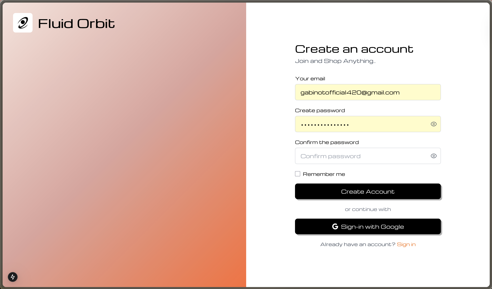
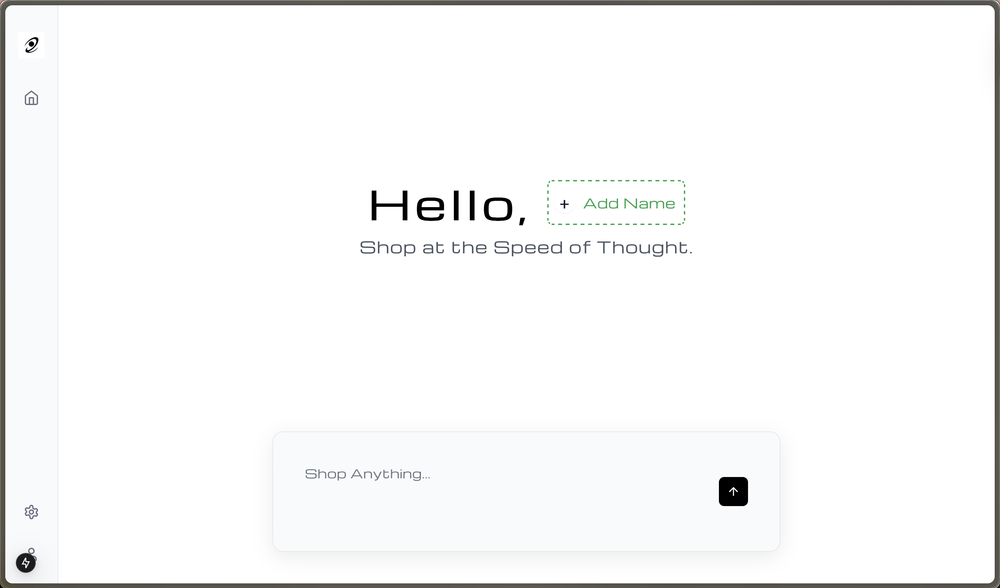
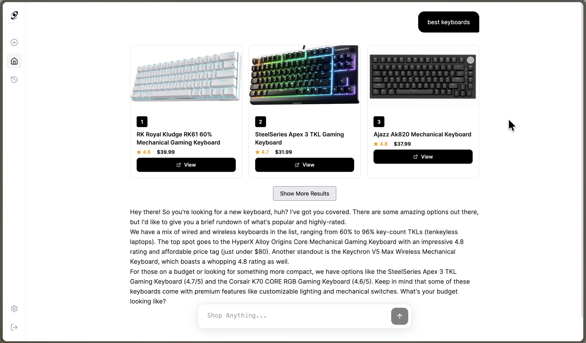
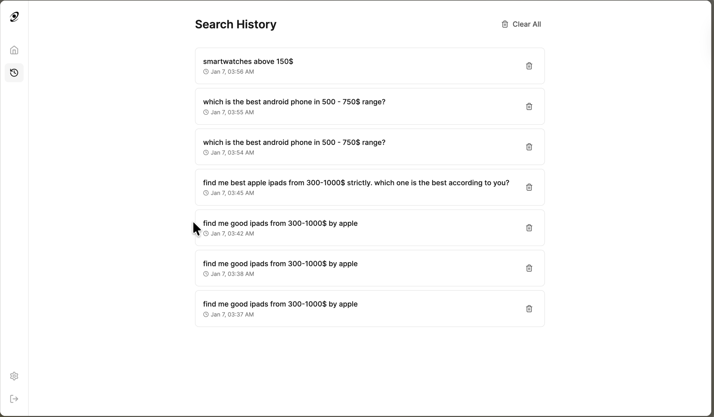
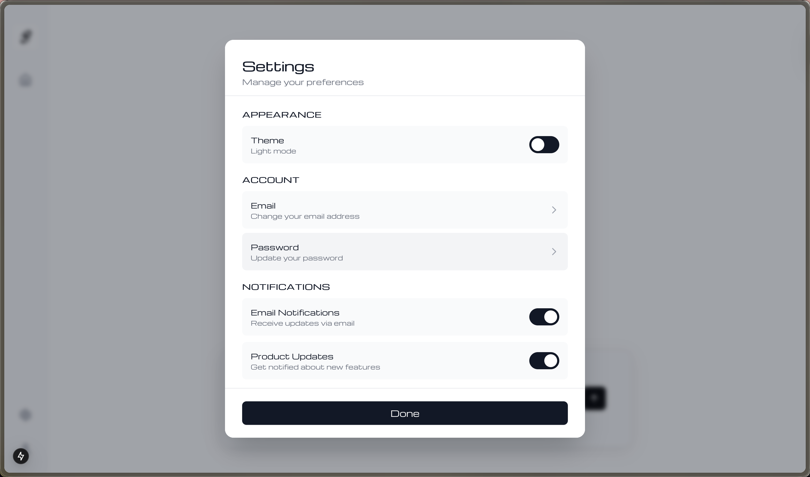
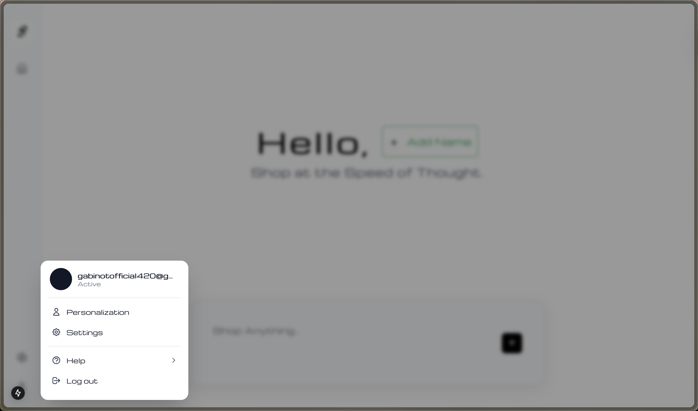
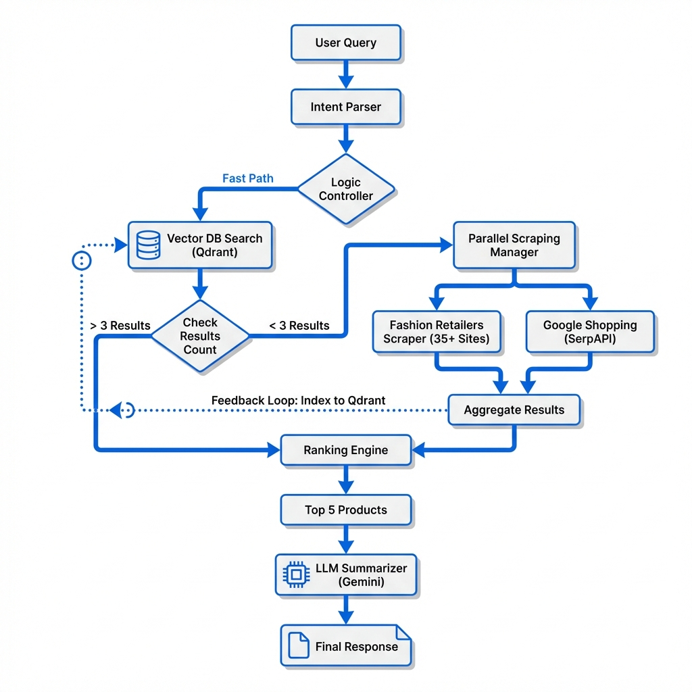

# FLUID ORBIT

> AI-Powered Product Research — No BS, Just Facts.

A next-generation RAG-based product recommendation engine that helps you make smarter shopping decisions with transparent scoring, semantic search, and real data.

<div align="center">
  
  <br/><br/>
  
  <br/><br/>
  
  <br/><br/>
  
  <br/><br/>
  
  <br/><br/>
  
</div>

---

## ✨ Latest Features (v2.26-v2.30)

- **🧠 Local Embeddings**: Semantic search with `all-MiniLM-L6-v2` (no API key needed)
- **📊 Query Classification**: Automatically detects query intent (best_product, deep_dive, spec_lookup, etc.)
- **📝 Centralized Logging**: Console + rotating file logs for debugging
- **💾 Persistent Chat**: Database-backed chat sessions (survives restarts)
- **🔍 Smart Chunking**: Every chunk includes product name for better retrieval

---

## Please look at instructions.txt on instructions to setup the API KEYS required


##  Quick Start

### Prerequisites
- Node.js 18+
- Python 3.11+
- 8GB+ RAM (for Jina embeddings model)

### Backend
```bash
cd backend
python3 -m venv venv
source venv/bin/activate
pip install -r requirements.txt
python -m uvicorn main:app --reload
```

### Frontend
```bash
cd frontend
npm install
npm run dev
```

**Open http://localhost:3000** 

---

## 🏗️ Architecture

```
FLU/
├── frontend/          # Next.js + TypeScript + TailwindCSS
│   └── app/           # App Router pages & components
├── backend/           # FastAPI + SQLite + Qdrant
│   └── app/
│       ├── routers/   # API endpoints (auth, query, history)
│       ├── services/  # RAG pipeline, embeddings, scraping
│       ├── models/    # SQLAlchemy models (User, ChatSession, etc.)
│       ├── schemas/   # Pydantic schemas
│       └── utils/     # JWT, logging, rate limiting, scheduler
├── logs/              # Application logs (auto-created)
├── qdrant_data/       # Vector database storage
└── docker-compose.yml # Production setup
```

---

## 🧠 Search & Retrieval Architecture


The system uses a sophisticated 3-Level Escalation strategy to balance speed and coverage:

### 1. Level 1: Memory (Fast Path)
*   **Vector DB (Qdrant)** is queried first using local embeddings (`all-MiniLM-L6-v2`).
*   If we have >3 high-quality results, they are returned instantly (< 200ms).

### 2. Level 2: Targeted Discovery (Parallel)
*   Reference: `ScrapingService`
*   Triggered if Level 1 has insufficient results.
*   Concurrently scrapes **35+ fashion retailers** (H&M, ASOS, Express, etc.) and tests **Google Shopping (SerpAPI)**.
*   Uses smart batching (10 stores concurrently) to maximize speed without rate limits.

### 3. Level 3: Deep Web (Fallback)
*   **Web Crawler** (DuckDuckGo Discovery) is launched if specific retailer searches fail.
*   Scrapes generic e-commerce pages for product data (JSON-LD, meta tags).

### 🔄 Feedback Loop
**Critical:** Every single product found in Level 2 or 3 is **automatically indexed** back into the Qdrant Vector DB. The system gets smarter and faster with every query.

### Query Types
- **best_product**: "best wireless earbuds under $100"
- **deep_dive**: "tell me about Sony WH-1000XM4"
- **multiple_listing**: "show me all gaming headsets"
- **spec_lookup**: "what's the battery life of AirPods Pro"
- **review_based**: "are Sony headphones worth it?"

---

## 🔑 API Keys (Optional)

| Key | Purpose | Required? |
|-----|---------|-----------|
| `GEMINI_API_KEY` | LLM responses (recommended) | No - uses fallback |
| `OPENAI_API_KEY` | Alternative LLM | No |
| `SERPAPI_KEY` | Product scraping (Google Shopping) | No - direct scraping fallback |
| `GOOGLE_CLIENT_ID` | OAuth sign-in | No - email auth works |

**Demo mode works without any API keys!** Jina embeddings run locally.

---

## 📊 Logging

Logs are written to:
- **Console**: Colored, concise output
- **File**: `./logs/shopgpt_YYYYMMDD.log` (rotating, 10MB max, 5 backups)

---

## 🎨 Design

Neobrutalism-inspired UI with:
- Thick black borders
- Hard drop shadows
- Bold typography
- Pink (#E31B5B) accent color

---

## 📝 License

MIT
